# EPI-Vision — 光学外延层厚度测定系统

基于 FTIR（傅里叶变换红外）反射光谱的半导体外延层厚度测量与分析平台。包含 **Web 端**（Flask）和**移动端**（uni-app）两个客户端，共享同一套后端 API。

---

## 目录

- [项目简介](#项目简介)
- [系统架构](#系统架构)
- [Web 端](#web-端)
  - [功能特性](#web-端功能特性)
  - [页面说明](#web-端页面说明)
  - [六大可视化](#六大可视化)
  - [快速启动](#web-端快速启动)
- [移动端](#移动端)
  - [功能特性](#移动端功能特性)
  - [页面说明](#移动端页面说明)
  - [快速启动](#移动端快速启动)
- [分析引擎](#分析引擎)
- [API 接口](#api-接口)
- [数据库设计](#数据库设计)
- [项目结构](#项目结构)
- [技术栈](#技术栈)

---

## 项目简介

外延层是半导体制造中生长在衬底表面的单晶薄膜。其厚度直接影响器件性能。本系统通过分析红外干涉光谱中的驻波干涉条纹，利用峰值间距法或传输矩阵法（TMM）自动计算外延层厚度，并提供多种专业可视化手段辅助分析。

支持材料：**SiC（碳化硅）、Si（硅）、GaN（氮化镓）、GaAs（砷化镓）** 等半导体材料。

---

## 系统架构

```
┌──────────────┐     ┌──────────────┐
│   Web 端      │     │   移动端      │
│  (Flask 模板)  │     │  (uni-app)   │
│  浏览器访问    │     │  Android/iOS │
└──────┬───────┘     └──────┬───────┘
       │                    │
       │   HTTP / REST API  │
       └────────┬───────────┘
                │
        ┌───────▼───────┐
        │  Flask 后端     │
        │  app.py        │
        ├───────────────┤
        │  core/         │
        │  ├ analyzer.py │  ← 分析引擎
        │  ├ db.py       │  ← 数据库层
        │  └ spectrum_   │  ← 服务端绘图
        │    plot.py     │
        ├───────────────┤
        │  SQLite 数据库  │
        └───────────────┘
```

Web 端直接由 Flask 模板渲染，移动端通过 REST API 获取数据和服务端渲染的 base64 图片。

### 功能分析图

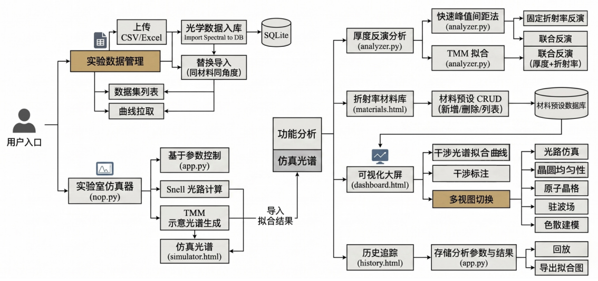

### 系统架构概览

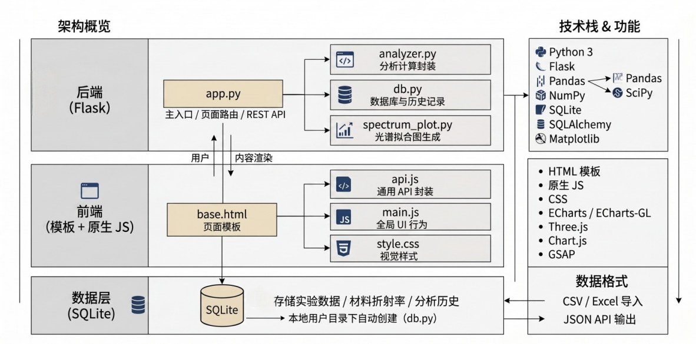

---

## Web 端

### Web 端功能特性

- **双算法分析**：峰值间距法（快速）与 TMM 拟合法（精细）
- **三种反演模式**：固定折射率反演厚度、联合反演（厚度 + n_film）
- **智能截断建议**：自动推荐最佳起始波数
- **六种专业可视化**：光谱拟合、光路模拟、晶圆热力图、3D 晶格、驻波场、色散曲线
- **数据导入**：支持 CSV / Excel (.xlsx) 上传
- **材料管理**：折射率数据库增删改查
- **历史归档**：每次分析自动保存，支持回放与导出
- **三套主题**：深空 / 翡翠 / 黑曜石，毛玻璃风格 UI
- **状态持久化**：参数与主题偏好保存至 localStorage
- **跨端渲染**：前端 ECharts/Three.js 交互 + 后端 Matplotlib PNG 备选

### Web 端页面说明

#### 1. 分析仪表盘 `/`

核心分析页面，包含：

- **参数控制面板**：数据集选择、算法切换、反演模式、材料预设、截断波数（含自动建议）、折射率参数、峰检测距离
- **KPI 指标卡**：外延层厚度 (μm)、拟合置信度 (%)、检测峰数量、平均峰间距 (Δν)
- **六个可视化标签页**（详见下方）
- **数据导入弹窗**：上传文件、指定材料与角度、可选覆盖
- **导入到实验室**：将分析结果传递到模拟器页面

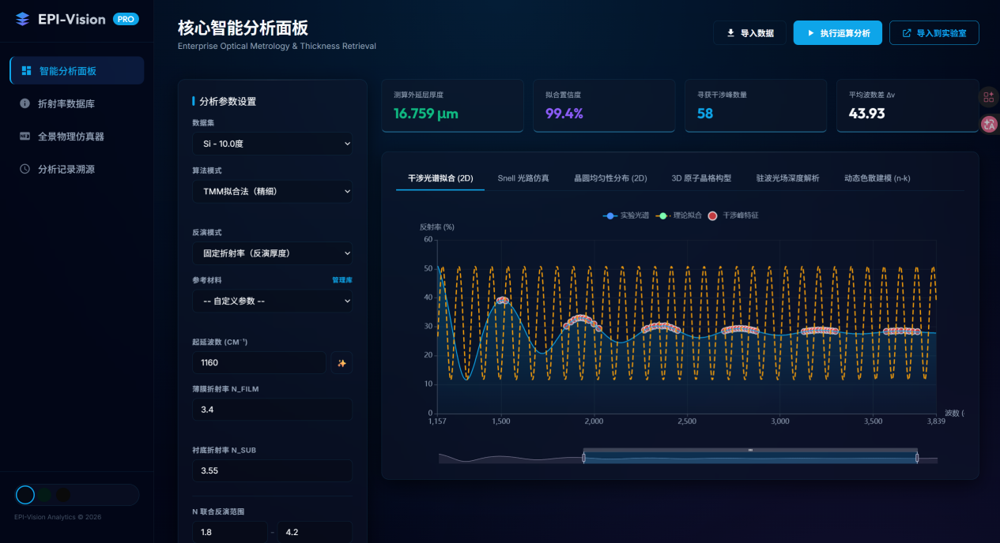

#### 2. 物理模拟器 `/simulator`

- **实时光路追踪 Canvas**：斯涅尔定律折射/反射路径，对数尺度膜厚 (0–100 μm)
- **理论反射率谱线**：Chart.js 实时绘制 Fabry-Perot 干涉曲线
- **交互滑块**：厚度、n_film、n_sub、入射角，均带同步数值输入
- **材料预设加载**：从后端获取材料库
- **实验室导入**：接收仪表盘分析结果，自动同步参数

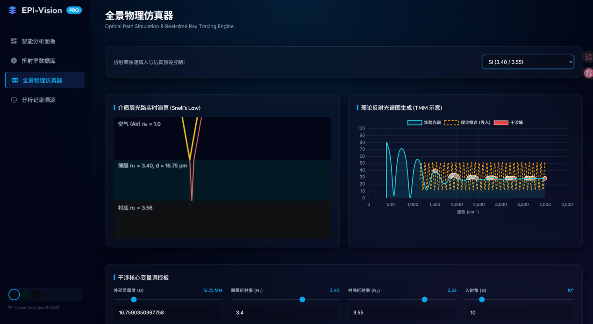

#### 3. 材料管理 `/materials`

- 材料列表（名称、n_film、n_sub）
- 添加/更新材料（弹窗表单）
- 删除材料（确认对话框）
- 内置默认：SiC (2.60/2.55)、Si (3.40/3.55)、GaN (2.35/2.30)、GaAs (3.30/3.45)

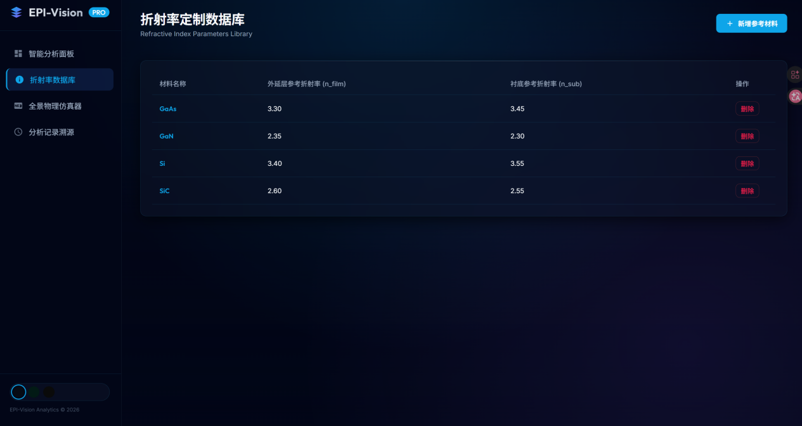

#### 4. 历史记录 `/history`

- 左侧：历史分析列表（数据集名、厚度、时间戳）
- 右侧：详情面板（KPI、算法、MSE、原始参数 JSON、光谱图）
- 支持导出光谱 PNG

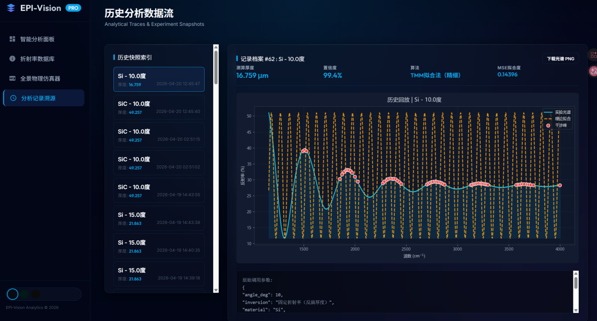

### 六大可视化

| # | 名称 | 技术 | 说明 |
|---|------|------|------|
| 0 | 干涉光谱拟合图 | ECharts | 实测光谱（青色面积填充）+ 理论拟合（橙色虚线）+ 检测峰（红色散点），支持数据缩放 |
| 1 | 斯涅尔光路模拟 | Canvas | 实时绘制光线在空气/薄膜/衬底中的折射与反射路径，带辉光效果 |
| 2 | 晶圆均匀性分布 | ECharts 热力图 | 40×40 网格模拟径向厚度变化（中心厚边缘薄），圆形遮罩 |
| 3 | 3D 晶格结构 | Three.js WebGL | 交互式 3×3×3 立方晶格，按材料区分原子颜色，自动旋转 |
| 4 | 驻波场深度分析 | ECharts 热力图 | 波数×深度二维热力图，展示膜内驻波强度分布 |
| 5 | 色散曲线建模 | ECharts 双轴 | 折射率 n（左轴）+ 消光系数 k（右轴）+ 参考线 + 置信包络 |

**干涉光谱拟合（峰值间距法）**

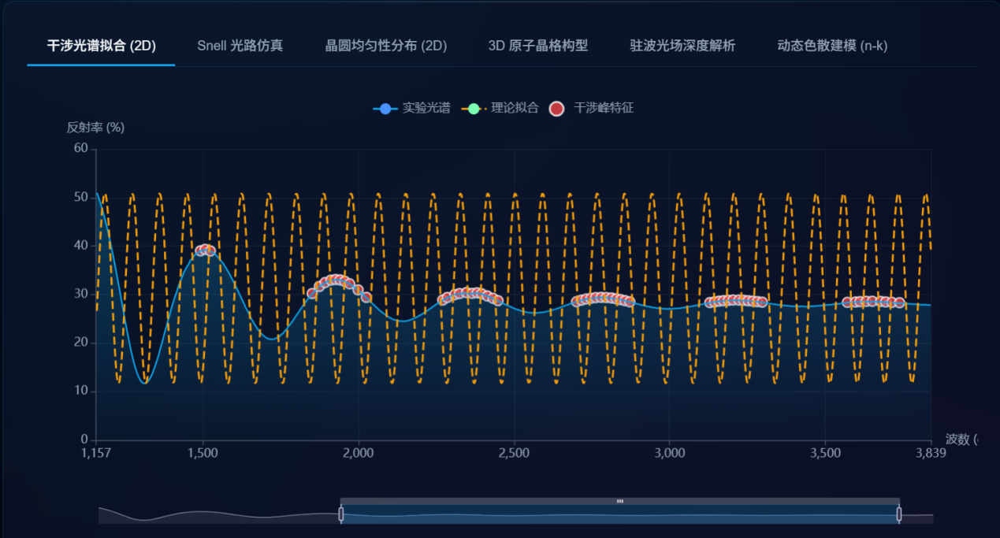

**斯涅尔光路模拟**

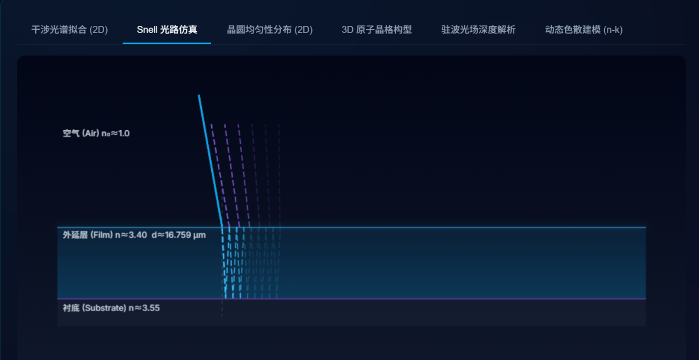

**晶圆均匀性分布**

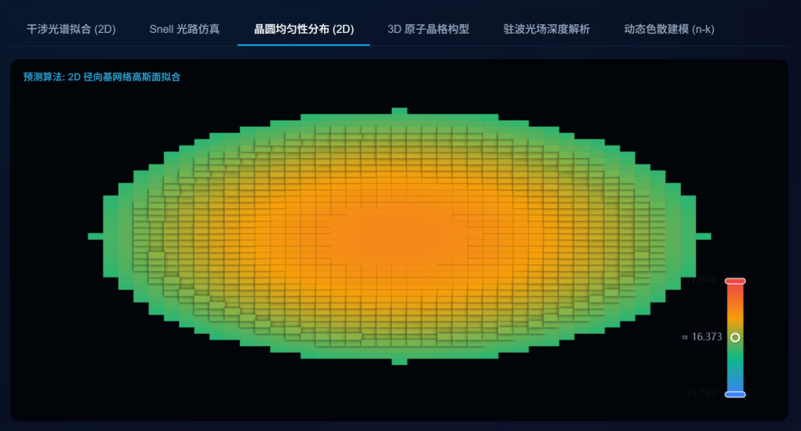

**3D 晶格结构**

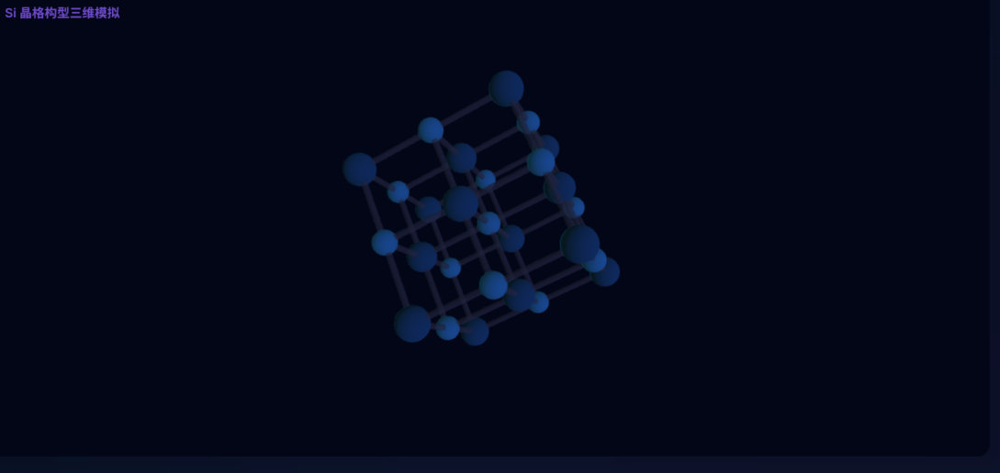

**驻波光场深度解析**

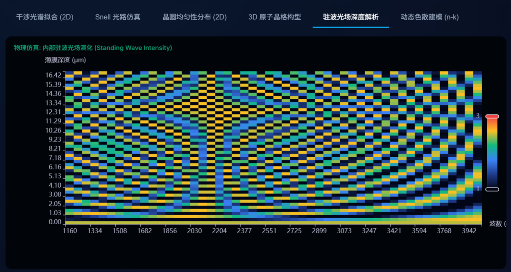

**动态色散建模**

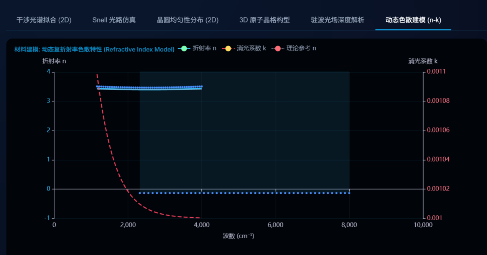

### Web 端快速启动

```bash
# 1. 克隆仓库
git clone https://github.com/liduanchen/-Web-.git
cd -Web-

# 2. 创建虚拟环境
python -m venv .venv
.venv\Scripts\activate          # Windows
# source .venv/bin/activate     # macOS/Linux

# 3. 安装依赖
pip install -r requirements-web.txt
pip install matplotlib sqlalchemy

# 4. 启动服务
cd web_app
python app.py
```

浏览器打开 **http://localhost:5050** 即可访问。

端口可通过环境变量修改：`PORT=8080 python app.py`

**内置数据**：`web_app/data/` 目录包含 4 组示例数据（SiC/Si × 10°/15°），需在页面中手动导入后使用。

---

## 移动端

### 移动端功能特性

- **跨平台**：基于 uni-app (Vue 2)，一套代码编译为 Android / iOS / H5
- **共享后端**：复用 Flask API，无需独立后端
- **服务端渲染图表**：复杂可视化由后端 Matplotlib 生成 base64 PNG，客户端直接显示
- **客户端 Canvas**：光路追踪与光谱仿真使用原生 Canvas 实时渲染
- **手势缩放**：自定义双指缩放 (1x–6x) + 单指平移，点击查看光谱细节
- **状态持久化**：仪表盘参数自动保存，跨页面数据传递
- **国际化**：支持中文 / 英文切换（i18n 模块）
- **深空主题**：与 Web 端一致的暗色毛玻璃风格

### 移动端页面说明

#### 1. 分析面板（Dashboard）— Tab: "分析"

- 后端健康检查（连接状态指示灯）
- 数据集选择、算法切换、反演模式、材料预设
- 自动截断建议
- 一键分析，KPI 动画数字滚动
- **可视化中心**：5 个水平滚动标签页
  - 光谱拟合图（支持手势缩放）
  - 晶圆均匀性热力图
  - 晶格结构图
  - 驻波场分析图
  - 色散曲线图
- 数据导入（仅 H5 端支持文件选择）
- 同步到模拟器

#### 2. 物理仿真（Simulator）— Tab: "仿真"

- **光路追踪 Canvas**：空气/薄膜/衬底三层结构，最多 14 次内反射，衰减透明度
- **光谱 Canvas**：Fabry-Perot 理论反射曲线 + 实测数据叠加
- **四组参数滑块**：厚度 (0.05–100 μm)、n_film、n_sub、入射角
- 接收仪表盘导入的分析参数

#### 3. 光路图（Optics）— Tab: "光路"

- 独立教学工具，完全离线运行
- 斯涅尔定律彩色光路：入射（红）、表面反射（橙）、折射（绿）、内反射（绿虚线）、出射（紫）、透射（青）
- 角度弧线标注（度数）
- 全内反射检测与警告
- 五组可调参数：n₀、角度、n₁、n₂、厚度

#### 4. 历史记录（History）— Tab: "历史"

- 分析记录列表（数据集名、厚度、时间戳）
- 详情面板：KPI 卡片 + 光谱图（支持缩放）+ 原始参数 JSON
- 图片保存：App 端存入相册，H5 端浏览器下载
- 下拉刷新

#### 5. 材料库（Materials）— Tab: "材料"

- 材料列表（名称、n_film、n_sub）
- 添加/更新、删除操作
- 下拉刷新

### 移动端快速启动

#### 方式一：HBuilderX（推荐）

1. 下载并安装 [HBuilderX](https://www.dcloud.io/hbuilderx.html)
2. 打开 `web_app/mobile-app/` 目录
3. 运行 → 运行到 Android 模拟器 / 运行到设备
4. 打包：发行 → 原生 App-云打包

#### 方式二：CLI 命令行

```bash
cd web_app/mobile-app

# 安装依赖
npm install

# H5 开发模式
npm run dev:h5

# H5 生产构建
npm run build:h5

# App 开发模式
npm run dev:app

# App 生产构建
npm run build:app
```

#### 配置后端地址

编辑 `common/config.js`，将 `baseUrl` 修改为你的 Flask 服务器地址：

```javascript
export const baseUrl = 'http://192.168.1.10:5050';
```

> 注意：移动端与 Flask 后端需在同一局域网内，或使用公网可访问的地址。

---

## 分析引擎

### 峰值间距法（快速）

1. 使用 `scipy.signal.find_peaks` 检测干涉峰
2. 计算平均峰间距 Δν (cm⁻¹)
3. 厚度公式：`d = 10000 / (2 × n_film × cos(θ') × Δν)` (μm)
4. 拟合曲线：以第一个峰为锚点的余弦模型

### TMM 拟合法（精细）

1. 实现完整的**传输矩阵法**（Transfer Matrix Method）
2. 分别计算 s 偏振和 p 偏振的菲涅尔系数
3. 平均反射率：`R = 0.5 × (|r_s|² + |r_p|²)`
4. 在 52 个厚度网格点搜索最小 MSE

### 反演模式

| 模式 | 说明 |
|------|------|
| 固定折射率 | n_film 固定，仅搜索厚度 |
| 联合反演 | 在 [n_min, n_max] 范围内扫描 38 个 n_film 值，每个 n 做局部厚度搜索（36 点），找全局最优 |

### 自动截断建议

- 扫描 600–2200 cm⁻¹（步长 40）的截断候选
- 评分公式：`peak_count × 12 - std_of_spacings × 6`
- 约束：截断后至少保留 80 个数据点和 3 个峰

---

## API 接口

| 方法 | 路径 | 说明 |
|------|------|------|
| GET | `/api/health` | 健康检查 |
| GET | `/api/datasets` | 获取所有数据集列表 |
| GET | `/api/dataset_data` | 获取指定数据集的波数/反射率数组 |
| GET | `/api/materials` | 获取材料列表 |
| POST | `/api/materials` | 添加/更新材料 |
| DELETE | `/api/materials/<name>` | 删除材料 |
| POST | `/api/suggest_cutoff` | 自动建议最佳截断波数 |
| POST | `/api/analyze` | 执行完整分析（返回光谱数据、拟合、峰、厚度、KPI、驻波、色散等） |
| GET | `/api/history` | 获取分析历史列表 |
| GET | `/api/history/<id>` | 获取历史详情（含光谱图） |
| POST | `/api/import` | 导入 CSV/Excel 数据文件 |
| POST | `/api/plot/wafer` | 渲染晶圆均匀性热力图 PNG |
| POST | `/api/plot/crystal` | 渲染晶格结构 PNG |
| POST | `/api/plot/standing-wave` | 渲染驻波场热力图 PNG |
| POST | `/api/plot/dispersion` | 渲染色散曲线 PNG |

---

## 数据库设计

SQLite 数据库，三张表：

| 表名 | 字段 | 说明 |
|------|------|------|
| **ExperimentalData** | id, material, angle, wavenumber, reflectance | 导入的光谱数据 |
| **Materials** | id, name (UNIQUE), n_film, n_sub | 材料折射率库 |
| **AnalysisHistory** | id, timestamp, dataset_name, method, n_film, n_sub, thickness, fit_confidence, mse, parameters_json, result_json | 分析历史归档 |

---

## 项目结构

```
├── requirements-web.txt              # Python 依赖
├── README.md                         # 本文档
└── web_app/
    ├── app.py                        # Flask 主应用（路由 + API）
    ├── epi_vision_qt.py              # Qt 桌面端（独立，非 Web 依赖）
    ├── core/
    │   ├── analyzer.py               # 分析引擎（峰值检测、TMM、厚度计算）
    │   ├── db.py                     # 数据库层（SQLite + SQLAlchemy）
    │   └── spectrum_plot.py          # 服务端 Matplotlib 渲染（base64 PNG）
    ├── templates/
    │   ├── base.html                 # 基础布局（侧边栏、主题切换）
    │   ├── dashboard.html            # 分析仪表盘
    │   ├── simulator.html            # 物理模拟器
    │   ├── materials.html            # 材料管理
    │   └── history.html              # 历史记录
    ├── static/
    │   ├── css/style.css             # 主题样式（三套主题）
    │   ├── js/api.js                 # 前端 API 客户端
    │   └── js/main.js                # 主题切换、导航、通知
    ├── data/
    │   ├── SiC 10度.xlsx             # SiC 10° 实测数据
    │   ├── SiC 15度.xlsx             # SiC 15° 实测数据
    │   ├── Si 10度.xlsx              # Si 10° 实测数据
    │   └── Si 15度.xlsx              # Si 15° 实测数据
    └── mobile-app/                   # 移动端（uni-app / Vue 2）
        ├── App.vue                   # 根组件（全局主题变量）
        ├── main.js                   # Vue 入口
        ├── manifest.json             # App 元数据与权限
        ├── pages.json                # 路由与 TabBar 配置
        ├── package.json              # npm 依赖与构建脚本
        ├── uni.scss                  # 全局组件样式
        ├── common/
        │   ├── config.js             # 后端地址配置
        │   ├── api.js                # API 请求封装
        │   └── i18n.js               # 国际化（中/英）
        ├── pages/
        │   ├── dashboard/            # 分析面板
        │   ├── simulator/            # 物理仿真
        │   ├── optics/               # 光路图
        │   ├── history/              # 历史记录
        │   └── materials/            # 材料库
        └── docs/
            ├── ARCHITECTURE_AND_USAGE.md
            └── WEB_TO_MOBILE_MIGRATION.md
```

---

## 技术栈

### 后端

| 技术 | 用途 |
|------|------|
| Python Flask ≥ 3.0 | Web 框架与 API 服务 |
| NumPy / SciPy | 科学计算、峰值检测 |
| pandas + openpyxl | 数据解析与 Excel 导入 |
| SQLAlchemy + SQLite | 数据库 ORM 与存储 |
| Matplotlib (Agg) | 服务端图表渲染（base64 PNG） |

### Web 前端

| 技术 | 用途 |
|------|------|
| ECharts 5.4 + ECharts-GL | 2D/3D 交互式图表 |
| Three.js r128 | 3D 晶格渲染 |
| Chart.js | 模拟器/历史页面图表 |
| GSAP 3.12 | KPI 数字动画 |
| Google Fonts (Inter/Outfit) | 字体 |
| CSS Variables | 三套主题切换 |

### 移动端

| 技术 | 用途 |
|------|------|
| uni-app (Vue 2) | 跨平台框架（Android/iOS/H5） |
| uni.request / uni.uploadFile | API 通信 |
| Canvas 2D | 光路追踪与光谱仿真 |
| SCSS + CSS Variables | 主题样式 |
| 自定义 i18n 模块 | 中英文切换 |
